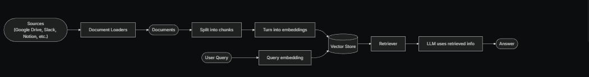
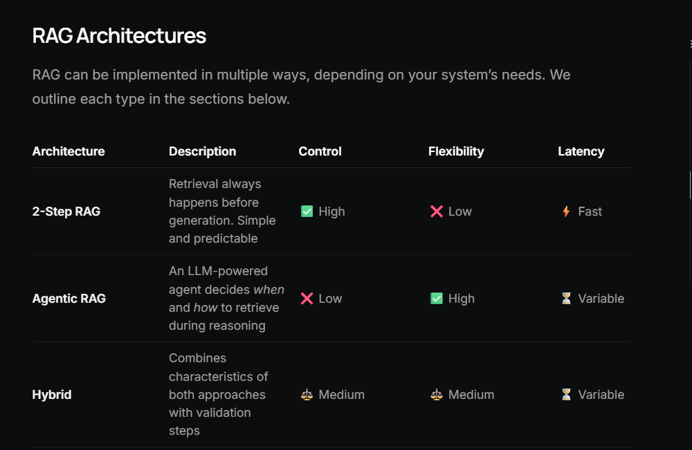
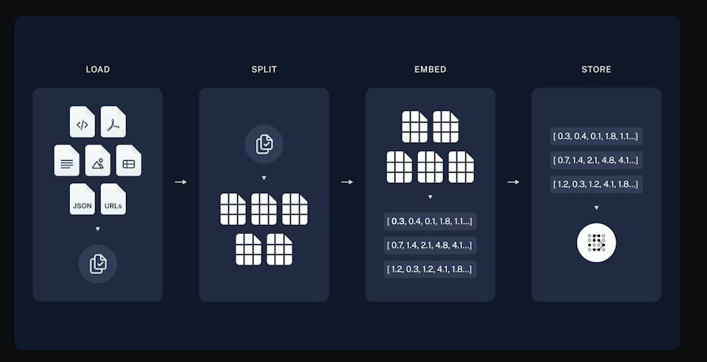
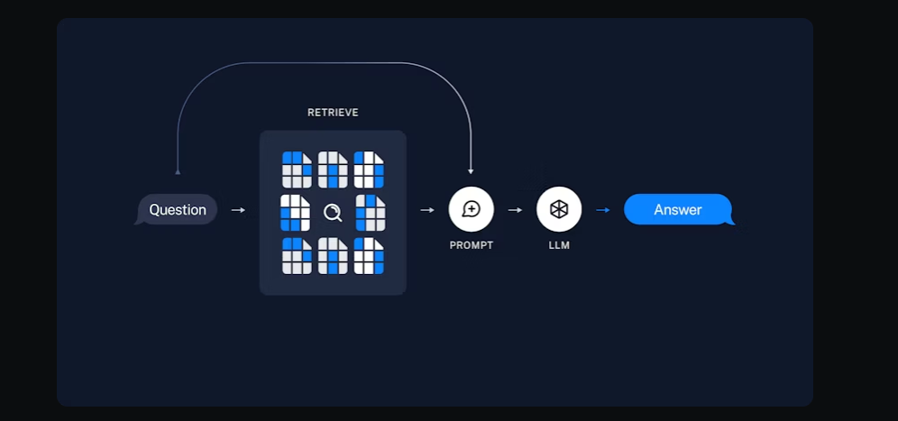
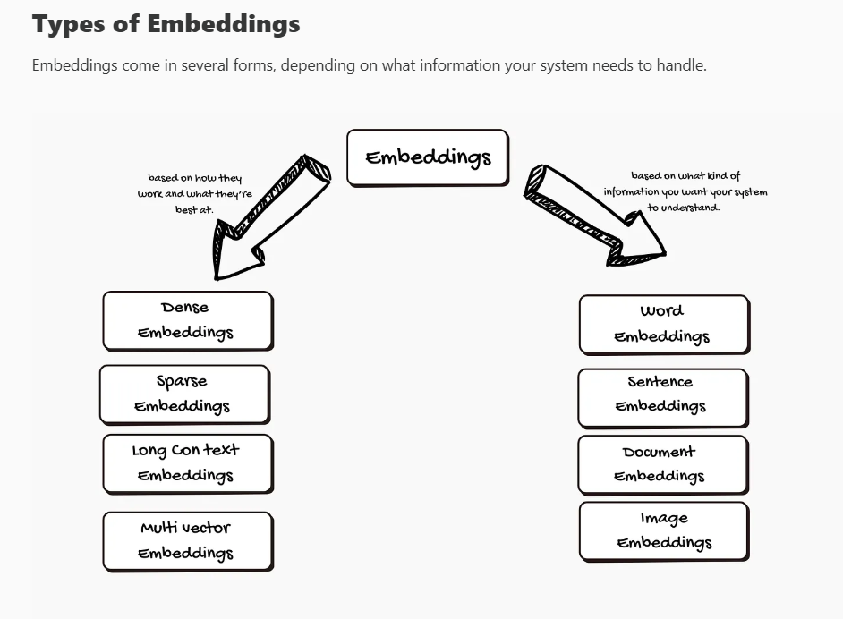
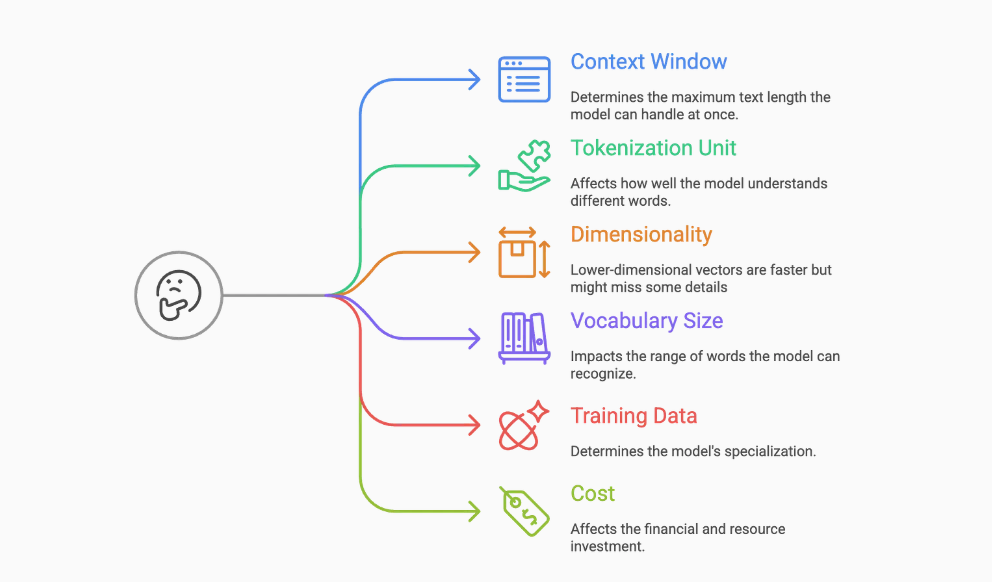
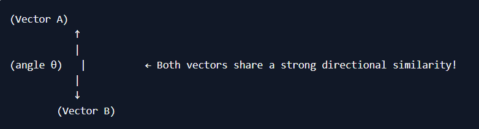
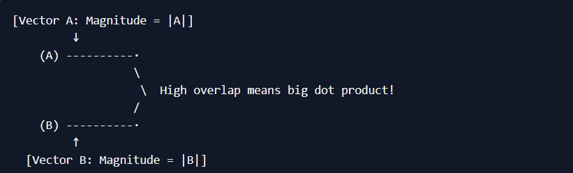
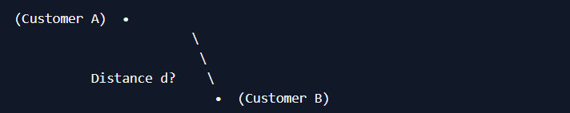

# RAG

Retrieval-Augmented Generation (RAG) is an advanced AI framework that combines information retrieval with text generation models like GPT to produce more accurate and up-to-date responses. Instead of relying only on pre-trained data like traditional language models, RAG fetches relevant documents from an external knowledge source before generating an answer.

# Building Blocks

- Document Loader

- Text Splitters

- Embedding Models

- Vector Stores

-  Retrievers

# RAG Architecture

# 1.Indexing

Indexing commonly works as follows:

Load: First we need to load our data. This is done with Document Loaders.

Split: Text splitters break large Documents into smaller chunks. This is useful both for indexing data and passing it into a model, as large chunks are harder to search over and won’t fit in a model’s finite context window.

Store: We need somewhere to store and index our splits, so that they can be searched over later. This is often done using a VectorStore and Embeddings model.

# 2. Retrieval and Generation

RAG applications commonly work as follows:

Retrieve: Given a user input, relevant splits are retrieved from storage using a Retriever.

Generate: A model produces an answer using a prompt that includes both the question with the retrieved data

# Evaluation Metrics:

- Context Precision

Measures how relevant the retrieved context chunks are to the user question.

- Context Recall

Measures how much of the necessary information (to answer the question) is present in the retrieved context.

- Faithfulness

Measures whether the model's answer is grounded in the retrieved context, without hallucinating extra facts

- Answer Relevancy

Measures how relevant and on-topic the model’s answer is to the user’s question.

# Evaluation Results:

context_precision: 0.8333

context_recall: 0.6000

faithfulness: 0.8300

answer_relevancy: 0.6970

# Embeddings

Embeddings are the numeric representation that captures the meanings and patterns in language. These numbers help your system find information that’s closely related to the question or topic

These embeddings are created using an Embedding model. Embedding model takes words, images, documents, even sounds, and turns it into a series of numbers called a vector.

1.Word Embeddings

Word embeddings represent each word as a point in a multi-dimensional space. Words with similar meanings like “dog” and “cat”en d up close together. This helps computers understand the relationships between words, not just their spelling.

Popular word embedding models include:

Word2Vec: Learns word relationships from large amounts of text.

GloVe: Focuses on how often words appear together.

FastText: Breaks words into smaller parts, making it better at handling rare or misspelled words.

2 Sentence Embeddings

Sometimes, the meaning could be learnt from only the whole sentence, not just single words. Sentence embeddings capture the overall meaning of a sentence as a vector.

Well-known sentence embedding models are:

Universal Sentence Encoder (USE):Works well with all types of sentences, including questions and statements.

SkipThought: Learns to predict surrounding sentences, helping the model understand context and intent.

3 Document Embeddings

A document can be anything from a paragraph to a whole book. Document embeddings turn all the text into a single vector. This makes searching through large collections of documents easier and helps find content related to your query.

Leading document embedding models include:

Doc2Vec: Builds on Word2Vec, but is designed for longer texts.

Paragraph Vectors: Similar to Doc2Vec, but focuses on shorter text sections like paragraphs.

4 Image Embeddings:

Text isn’t the only type of information RAG systems can work with images. Image embeddings turn a picture into a list of numbers that describe colors, shapes, and patterns.

Popular image embedding model is Convolutional Neural Networks (CNNs). It is especially good at spotting patterns in images.

# Based on the characteristic of the embedding:

-Dense Embeddings

Dense embeddings use vectors where almost every number is filled in with a value. Each value holds a bit of information about the word, sentence, image, or document. Dense vectors are compact and efficient. They store a lot of details in a small space. This makes it easier for computers to compare things and find similarities quickly.

-Sparse Embeddings

Sparse embeddings are the opposite of dense. Most of the numbers in the vector are zero, and only a few spots have actual values. The zeros don’t carry any information. Sparse embeddings help highlight just the most important features. They can make it easy to spot what makes something unique or different from others.

# Parameters for Choosing the Best Text Embedding Model

# Vector Similarity

In RAG workflows, we store document or text embeddings as vectors in a database. When we want to retrieve the most relevant items from our stored vectors, we need a way to measure how close (or similar) these vectors are to each other. Three common approaches are:

- Cosine Similarity
- Dot Product
- Euclidean Distance

# Cosine Similarity

Cosine similarity looks at the angle between two vectors rather than their overall magnitude. Imagine you have two arrows on a dartboard. The difference in their directions (angles) tells you how “similar” they are, irrespective of how long each arrow is.

## When to Use Cosine Similarity

- Comparing Text Documents: Often used in NLP tasks because two documents can be similar in topic (direction of the arrow) even if one is much longer than the other (length of the arrow).

- Ignoring Magnitude Differences: If you only care about the direction or overall pattern, cosine similarity is a strong choice.

 # Illustration for Cosine Similarity

 

 # Dot Product
 
 Dot product measures a combination of direction and magnitude. If you multiply the lengths of two vectors and the cosine of the angle between them, you get the dot product. This means if your vectors are large and align closely, you get a higher dot product value.
 
 # When to Use Dot Product
 - Weighted Matches: If the magnitude (length of the embedding) is significant—maybe you really do care that one document is larger or has higher “importance” in some feature dimension.
 
 - Neural Network Outputs: Often used in final layers or attention mechanisms where magnitude of embeddings is deliberately scaled or normalized in certain ways.
 
 # Illustration for Dot Product
 
 

 
  # Euclidean Distance
 
  Euclidean distance is the straight-line distance between two points in a multi-dimensional space—just like a ruler in geometry class. If you imagine each vector as a point on a graph, Euclidean tells you exactly how far one point is from the other.
 
  # When to Use Euclidean Distance
 
 -Spatial/Geometric Concepts: When your data naturally fits a scenario where direct distance matters. Think of a GPS coordinate system, or an image pixel comparison.
 
 -Clustering: Many clustering algorithms (like k-means) rely on Euclidean distance to group similar data points together.
 
 # Illustration for Euclidean Distance
 
 

 

# reference

https://docs.langchain.com/oss/python/langchain/retrieval

 https://huggingface.co/spaces/mteb/leaderboard
           
https://vivedhaelango.substack.com/p/how-to-choose-the-right-embedding

        